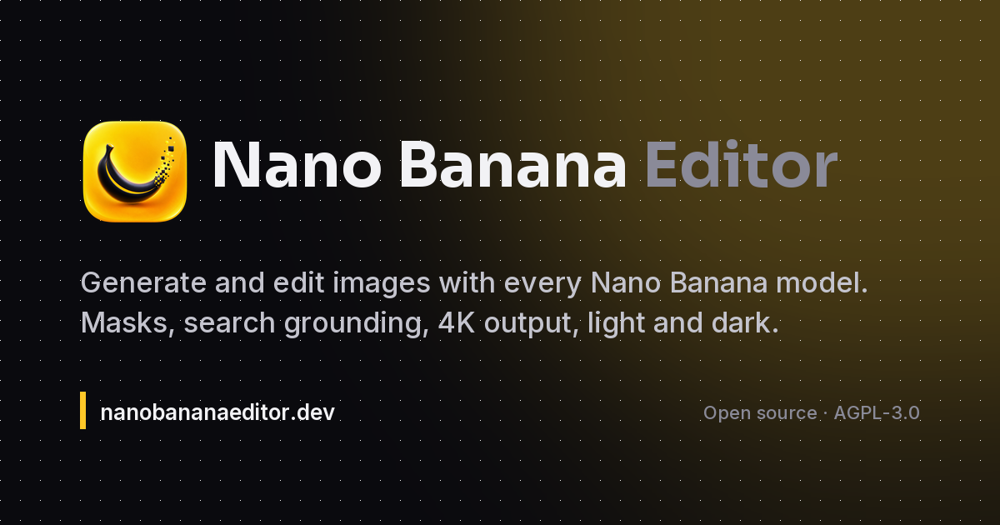

<p align="center"></p>

<h1 align="center">Nano Banana Editor</h1>

<p align="center"><strong>Generate and edit images with every Nano Banana model, in one editor.</strong></p>

<p align="center"><a href="https://nanobananaeditor.dev">nanobananaeditor.dev</a> · <a href="docs/self-hosting.md">Self-hosting guide</a> · <a href="docs/architecture.md">Architecture</a> · <a href="CHANGELOG.md">Changelog</a></p>



Nano Banana Editor is a React + TypeScript app for Google's Gemini image models. Write a prompt, drop in reference photos, paint a mask, ground the prompt in live search results, and render anything from a 512px draft to a 4K final. Every render lands in a local history you can branch from.

### Get your own copy

Join the [Vibe Coding is Life Skool community](https://www.skool.com/vibe-coding-is-life/about?ref=456537abaf37491cbcc6976f3c26af41) for the one-click Bolt.new install, project downloads, live build sessions and prompts.

---

## Models

| Model | ID | Output sizes | Inputs | Search grounding | Thinking |
| --- | --- | --- | --- | --- | --- |
| Nano Banana 2 Lite | `gemini-3.1-flash-lite-image` | 1K | up to 14 | no | Fast / Deep |
| Nano Banana 2 | `gemini-3.1-flash-image` | 512, 1K, 2K, 4K | up to 10 | yes | Fast / Deep |
| Nano Banana Pro | `gemini-3-pro-image` | 1K, 2K, 4K | up to 6 | yes | always on |

Aspect ratios: 1:1, 3:2, 2:3, 4:3, 3:4, 5:4, 4:5, 16:9, 9:16, 21:9, plus 4:1, 1:4, 8:1 and 1:8 on the two Flash models.

## Credits

One catalog, [`src/lib/models.ts`](src/lib/models.ts), defines what each model can do and what it costs. The edge function keeps an identical copy so the client can never lie about a price.

| Model | 512 | 1K | 2K | 4K |
| --- | --- | --- | --- | --- |
| Nano Banana 2 Lite | – | 1 | – | – |
| Nano Banana 2 | 1 | 1 | 2 | 3 |
| Nano Banana Pro | – | 3 | 3 | 5 |

New accounts start with 5 free credits, granted by a database trigger on signup. Search grounding adds 1 credit. Credits are reserved server-side before the model runs and refunded automatically if the render fails or comes back empty.

Bring your own key: paste a Gemini API key from [AI Studio](https://aistudio.google.com/apikey) in Settings and requests bill your Google account directly. The key is stored only in your browser and sent per request over HTTPS.

## Features

- **Generate** from text with reference images, aspect ratio, resolution and 1, 2 or 4 parallel variants
- **Edit** any image with a sentence. Follow-up edits carry the last turns as context
- **Mask** a region with a brush and eraser so the change stays local
- **Search grounding** for prompts that need real-world facts (weather, scores, products)
- **Thinking control** on the Flash models: fast for simple prompts, deep for layouts and text
- **Compare** slider for before and after, one-click **4K re-render** with Nano Banana Pro
- **History** that survives refresh (IndexedDB), with per-item settings, model notes, grounding sources and request details
- Paste or drop images anywhere, copy results to the clipboard, download as PNG, JPG or WebP
- Light and dark themes, full keyboard control

## Keyboard shortcuts

| Keys | Action |
| --- | --- |
| `⌘ / Ctrl + Enter` | Generate or apply edit |
| `G` `E` `M` | Generate, Edit, Mask mode |
| `[` `]` | Brush smaller / larger |
| `X` | Brush / eraser |
| `Z` | Undo stroke |
| `C` | Compare before / after |
| `D` | Download |
| `H` `P` | Toggle history / composer |
| `T` | Toggle theme |
| `0` | Fit to screen |

## Running it yourself

The short version is below. The full walkthrough, including Stripe, custom SMTP and troubleshooting, is in [docs/self-hosting.md](docs/self-hosting.md).

### Prerequisites

- Node 18+
- A Supabase project
- A Gemini API key from [Google AI Studio](https://aistudio.google.com/apikey)
- A Stripe account if you want to sell credits (optional)

### 1. Install

```bash
git clone https://github.com/markfulton/NanoBananaEditor.git
cd NanoBananaEditor
npm install
cp .env.example .env
```

Fill in `VITE_SUPABASE_URL` and `VITE_SUPABASE_ANON_KEY` from your Supabase project settings.

### 2. Database

Apply the migrations in `supabase/migrations` in order (Supabase CLI: `supabase db push`, or paste them into the SQL editor). They create the credits table, the Stripe tables, the usage log and the server-only credit functions.

### 3. Edge functions

Set the secrets, then deploy:

```bash
supabase secrets set GEMINI_API_KEY=your-key
supabase secrets set STRIPE_SECRET_KEY=sk_... STRIPE_WEBHOOK_SECRET=whsec_...
supabase functions deploy nano-image
supabase functions deploy stripe-checkout
supabase functions deploy stripe-webhook --no-verify-jwt
```

`generate-image` and `edit-image` are legacy endpoints kept for older builds. New installs do not need them.

### 4. Run

```bash
npm run dev
```

Open `http://localhost:5173`. Sign up, confirm the email, and spend the 5 starter credits. After that, buy credits through Stripe or paste your own Gemini key in Settings.

### Scripts

| Command | What it does |
| --- | --- |
| `npm run dev` | Vite dev server |
| `npm run build` | Production build to `dist/` |
| `npm run typecheck` | Strict TypeScript check |
| `npm run lint` | ESLint |
| `npm run sync:models` | Copy the model catalog into the edge function after editing it |

## Architecture

The long version, with the request flow and the reasoning behind masks and multi-turn edits, is in [docs/architecture.md](docs/architecture.md).

```
src/
├── lib/models.ts            Model catalog: capabilities, ratios, sizes, credit costs
├── lib/actions.ts           Tiny action registry for shortcuts
├── store/useAppStore.ts     Composer, canvas and history state (persisted to IndexedDB)
├── store/useThemeStore.ts   Light / dark / system
├── store/useSettingsStore.ts  Own API key, download format
├── hooks/useGenerate.ts     Builds the request, runs variants, records history
├── hooks/useCredits.ts      Balance query
├── services/imageApi.ts     Client for the nano-image edge function
├── services/maskService.ts  Turns brush strokes into a mask and a tinted preview
└── components/              Composer, Canvas, HistoryPanel, ModelPicker, modals, ui/

supabase/
├── functions/nano-image     Auth, credit reservation, Gemini call, refund, usage log
├── functions/stripe-*       Checkout and webhook
└── migrations/              Schema, RLS, credit functions
```

Stack: React 18, TypeScript, Tailwind, Zustand, TanStack Query, Konva, Radix, Vite. Supabase for auth, Postgres and edge functions. `@google/genai` runs only inside the edge function, so the house API key never reaches the browser.

## Security notes

- The edge function requires a signed-in, email-confirmed user. The anon key alone cannot generate.
- Credits are deducted with a `SECURITY DEFINER` function that only the service role can execute. Users can read their balance and nothing else.
- Every render is written to `usage_log` with model, size, tokens and duration.

## Contributing

Issues and pull requests are welcome. Keep components focused, keep TypeScript strict, and run `npm run typecheck && npm run lint && npm run build` before opening a PR. If you touch `src/lib/models.ts`, run `npm run sync:models` and commit both copies.

## License

Copyright © 2026 [Mark Fulton](https://markfulton.com). Licensed under the [GNU Affero General Public License v3.0](LICENSE). If you run a modified version as a network service you must publish your source under the same license.

Built by [Mark Fulton](https://markfulton.com) · [Reinventing.AI](https://www.reinventing.ai) · [Vibe Coding is Life](https://www.skool.com/vibe-coding-is-life/about?ref=456537abaf37491cbcc6976f3c26af41)
